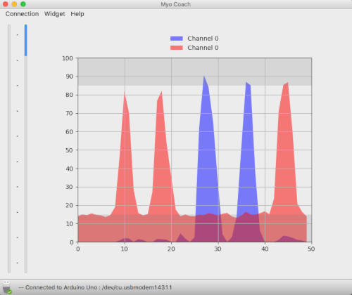
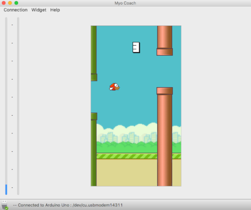

#MyoCoach : GUI

Ce projet s'inscrit dans le cadre d'un produit développé par la société Orthopus :  [Le MyoCoach](https://wiki.orthopus.com/myocoach/home)

Cette application permet la visualisation des signaux EMG et permet aux utilisateurs de s'entrainer en observant les signaux brut ou à travers un jeux qui est un clone inspiré de [FlapPyBird](https://github.com/sourabhv/FlapPyBird) avec un système de jeux différents. 

L'application MyoCoach est codé en python avec PyQt5

## Installation (Tester sous MacOS)

1. Installer [Python 3.x](https://www.python.org/downloads) (recommandé)

2. Installer [PIP](https://techworm.net/programming/install-pip-python-mac-windows-linux/)

```bash
$ sudo easy_install pip
```

3. Installer les autres packages nécessaire à l'application (pyQt5, serial, numpy, matplotlib...)

```bash
$ pip install pyqt5
$ pip install pyserial
$ pip install numpy
$ pip install matplotlib
```

4. cloner le répertoire de l'application

```bash
$ git clone %%https://github.com/orthopus/MyoCoach_GUI.git%%
```

ou télécharger le fichier zip et décompresser le.

4. lancer l'application avec votre terminal

```bash
$ cd %%MyoCoach_GUI%%
$ python3 MyoCoach.py
```

##Layout




##Auteur

* **David Gouaillier** - *Initial work*

##Licence

Ce projet est sous une licence Open Source CC BY-SA 4.0 - regarder le fichier [LICENSE.md](LICENSE.md) pour plus de détails.
